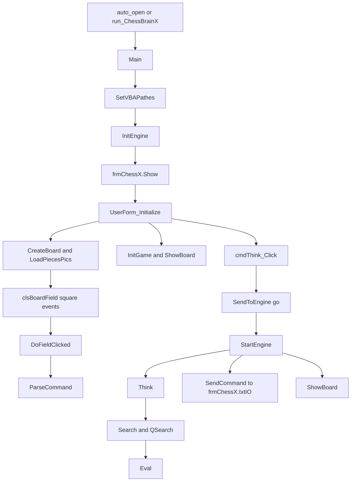

# Excel ChessBrainX Architecture

This document describes the Excel-VBA variant of the ChessBrain engine exported in this directory:

- Source root: `D:\Chess\ExcelChessbrainX`
- Host: Microsoft Excel with exported VBA modules, one UserForm, and one helper class
- Main UI: `frmChessX.frm`
- Macro entry points: `auto_open` and `run_ChessBrainX`

This is not the VB6 EXE project and not the VB.NET engine. The chess core is closely related to ChessBrainVB, but this variant is hosted by Excel and uses workbook sheets and a UserForm instead of a standalone executable protocol loop.

## High-Level Shape

Excel ChessBrainX is an Excel-hosted chess engine and GUI. The workbook loads exported VBA code, opens a UserForm chessboard, receives user moves through form events, and calls the same engine parser/search code used by the ChessBrainVB family.

The normal interactive path is:



`MainLoop` still exists in `basChessBrainVB.bas`, but the Excel UI does not normally run as a blocking stdin/stdout loop. The workbook is driven by UserForm events, Excel timers, and calls into `ParseCommand` and `StartEngine`.

## Source Inventory

The exported source directory contains standard VBA modules, one form, and one class:

- `basChessBrainVB.bas`: main macro startup, engine initialization, `MainLoop`, protocol parser, UCI position setup, and `auto_open`.
- `basUtilVBA.bas`: Excel/VBA glue, path discovery, square click handling, legal-move display, worksheet-backed settings, translation, and test-position helpers.
- `frmChessX.frm`: main Excel UserForm, board UI, piece images, time controls, buttons, chess clock, move list, and engine command dispatch.
- `clsBoardField.cls`: `MSForms.Image` event wrapper for dynamically created board squares.
- `basConst.bas`: constants, piece IDs, square IDs, enums, and shared structures such as `TMOVE`, `TMovePicker`, and `TScore`.
- `basBoard.bas`: board model, move generation, make/unmake, legal move checks, coordinate conversion, and game-state helpers.
- `basSearch.bas`: engine search, iterative deepening, alpha-beta, quiescence search, move ordering, search reporting, and best-move execution.
- `basEval.bas`: static evaluation, tapered scoring, piece-square tables, mobility, pawn structure, king safety, threats, material imbalance, and endgames.
- `basHash.bas`: Zobrist hashing and transposition table.
- `basTime.bas`: search time allocation, elapsed time checks, and Excel chess-clock timer bridge.
- `basBook.bas`: opening book loading from Excel sheets or text files.
- `basEPD.bas`: EPD/FEN-style position import/export.
- `basIO.bas`: output routing, INI access, tracing, tablebase integration, game read/write helpers, and protocol text formatting.
- `basCmdOutput.bas`: external command execution and captured output helpers.
- `basProcess.bas`: Win32 `CreateProcess` helper.
- `basDebug.bas`: debugging, tests, and benchmark helpers.

The folder contains exported source files only. The workbook file itself is not part of this directory, so worksheet structure is inferred from code.

## Startup and Excel Host Integration

The Excel startup path has two macro entry points:

- `auto_open` in `basChessBrainVB.bas` calls `Main` when the workbook opens.
- `run_ChessBrainX` in `basUtilVBA.bas` is a manual macro entry point that also calls `Main`.

`Main` sets Excel/VBA mode and then opens the form:

- Sets `pbIsOfficeMode = True`.
- Sets a smaller `GUICheckIntervalNodes` for frequent UI responsiveness.
- Calls `SetVBAPathes` to bind `ThisApp`, `psDocumentPath`, `psEnginePath`, and `psAppName`.
- Reads settings through `ReadINISetting`.
- Initializes translation strings.
- Calls `InitEngine`.
- Shows `frmChessX`.

`SetVBAPathes` detects the Office host through `Application.Name`. In Excel it uses `Application.ActiveWorkbook.Path` as the document and engine path, sets `pbMSExcelRunning = True`, and names the app `ChessBrainX`.

`frmChessX.UserForm_Initialize` performs additional UI setup:

- Reads board colors.
- Creates the visual board controls.
- Loads piece images.
- Initializes time controls, test sets, and chess-clock UI.
- Calls `InitEngine` and `InitGame`.
- Translates form captions and displays the board.

Because both `Main` and `UserForm_Initialize` call engine initialization, the Excel startup path may initialize the engine twice. This is acceptable for this codebase because `InitEngine` clears and rebuilds global engine state.

## User Interface Model

`frmChessX.frm` is the main application surface. It is a VBA `UserForm` with a dynamic 8x8 board, piece images, move list, settings controls, time controls, and output text.

`CreateBoard` dynamically creates 64 `Forms.Image.1` square controls. VBA does not support VB6-style control arrays, so every square is wrapped by a `clsBoardField` instance. The class exposes `WithEvents ImageEvents As MSForms.Image` and forwards clicks to `DoFieldClicked`.

The move input path is:

- The user clicks a square image.
- `clsBoardField.ImageEvents_Click` records the clicked square name in `psLastFieldClick`.
- `DoFieldClicked` in `basUtilVBA.bas` handles first-click source selection and second-click target selection.
- The helper validates color and legal moves, handles simple promotion selection, builds a coordinate move such as `e2e4`, and calls `ParseCommand`.
- The form refreshes the move list and board.
- If auto-think is enabled, `cmdThink_Click` starts an engine reply.

The form also supports setup mode. In setup mode, clicking a square cycles or places a selected piece instead of sending a move command.

## Command and Search Flow

The Excel UI reuses the same command parser style as the protocol engine. `frmChessX` contains `SendToEngine`, which calls:

```text
ParseCommand isCommand & vbCrLf
```

The Think button path is:

- `cmdThink_Click` updates side-to-move controls and time settings.
- It starts the Excel chess clock.
- It synchronizes WinBoard-style clock commands where needed.
- It sends `go` through `SendToEngine`.
- It calls `StartEngine`.

`ParseCommand` in `basChessBrainVB.bas` accepts UCI and WinBoard/XBoard-like commands. In the Excel export, UCI support includes engine identity, hash option, a one-thread `Threads` option, clear hash, Syzygy/tablebase options, `position`, `go`, `stop`, `ponderhit`, and `quit`. WinBoard-style moves and board setup commands are also handled.

`StartEngine` in `basSearch.bas` starts thinking only when the engine side is to move and the engine is not in force mode. It resets search counters and timing, calls `Think`, plays the selected move, stores it in the game move list, and emits either `bestmove ...` for UCI mode or translated `move ...` text for the form/protocol output.

`SendCommand` in `basIO.bas` routes output to `frmChessX.txtIO` in Office mode. Search status, move output, errors, and tablebase messages are therefore visible in the form instead of stdout.

## Engine Initialization

`InitEngine` in `basChessBrainVB.bas` rebuilds global engine state:

- Clears PV, history, continuation history, board, moved state, move lists, game moves, and game-position hashes.
- Initializes piece colors, movement offsets, promotion lists, rank/file tables, square colors, max distances, between-square lookup, x-ray lookup, and attack-bit counts.
- Builds the startup board and piece-square tables.
- Initializes evaluation parameters and material imbalance.
- Initializes EPD tables, opening book data, Zobrist hashing, tablebase support, and a new game.

The Excel version uses global module state heavily, matching the engine's VB lineage. This keeps search and move generation simple and fast in VBA.

## Board Representation

The engine uses a 120-cell mailbox board in `basBoard.bas`:

- `MAX_BOARD = 119`.
- Playable squares are embedded inside a 10x12 board with frame cells.
- Constants map squares such as `SQ_A1 = 21` and `SQ_H8 = 98`.
- `FRAME = 0` marks off-board frame cells.
- `NO_PIECE = 13` marks an empty playable square.
- White pieces have bit `1` set, so color checks often use `(piece And 1)`.

Important board globals include:

- `Board(MAX_BOARD)`: piece IDs by board square.
- `Pieces(32)`: piece-list index to square.
- `Squares(MAX_BOARD)`: square to piece-list index.
- `WKingLoc` and `BKingLoc`: king locations.
- `Moved(MAX_BOARD)`: moved-piece state for castling and evaluation.
- `EpPosArr(0 To MAX_DEPTH)`: en-passant dummy-square state.
- `Rank`, `RankB`, `File`, `RelativeSq`, `SqBetween`, and `DirOffset`: precomputed geometry helpers.

Moves are stored in `TMOVE`, defined in `basConst.bas`. A move carries source and target squares, piece/capture/promotion/castling/en-passant data, move ordering values, static exchange value, and legality/check flags.

`GenerateMoves` produces pseudo-legal moves into the global `Moves(Ply, index)` array. The search later validates moves with legality checks and uses `MakeMove` / `UnmakeMove` to traverse the tree without copying full positions.

## Search Architecture

The search pipeline follows the same ChessBrainVB family pattern:

```text
StartEngine -> Think -> SearchRoot -> Search -> QSearch -> Eval
```

Main search responsibilities:

- `Think`: iterative deepening and aspiration-window control.
- `SearchRoot`: root move generation and root-level search.
- `Search`: recursive alpha-beta search with pruning, reductions, extensions, hash probing, and move ordering.
- `QSearch`: capture and checking-move quiescence search.
- `Eval`: static evaluation at quiet nodes.

Search state includes principal variation arrays, killer moves, history and capture-history tables, counter moves, continuation history, root move counters, node counters, and final move/score fields.

The Excel version contains Office-specific responsiveness hooks. During long search work it uses `DoEvents` at GUI check intervals so the form can repaint and react to user input.

Pondering is much smaller in this export than in the newer VB6 SourcePonder engine. `ParseCommand` accepts `ponderhit` as a stop-like command, but the Excel UI path is primarily normal move search started by the Think button or auto-think.

## Evaluation

`basEval.bas` implements a tapered middlegame/endgame evaluation using `TScore` values.

The evaluation includes:

- Material and non-pawn material.
- Piece-square tables.
- Mobility.
- Pawn structure.
- Passed pawns.
- Threats and hanging pieces.
- King safety, pawn shelter, and pawn storm.
- Material imbalance.
- Endgame scaling and specialized endgame logic.

`InitEval` reads tunable values through the same settings abstraction used by the rest of the VBA engine. In Excel these settings can come from worksheet-backed configuration rather than a disk INI file.

## Hashing

`basHash.bas` implements Zobrist hashing and a transposition table:

- `THashKey` uses two 32-bit `Long` values.
- Zobrist tables cover piece-square combinations and relevant state.
- `InitHash` sizes and initializes the table.
- Hash table entries store position keys, depth, bound type, best move, evaluation, and static evaluation.

Unlike the VB6 SourcePonder EXE, this Excel export is effectively single-threaded in normal use. It does not rely on the shared-memory helper-process hash-map architecture used by the newer multi-process VB6 engine.

## Time Management and Chess Clock

`basTime.bas` owns search time budgeting:

- `AllocateTime` computes `OptimalTime` and `MaximumTime`.
- `CalcTime` estimates how much time to spend on the current move.
- `TimeElapsed` measures search duration.
- `CheckTime` decides when search should stop.

The UserForm adds an Excel chess-clock layer:

- `frmChessX` stores remaining clock values and active side state.
- `ChessClockStart`, `ChessClockStop`, and `ChessClockNotifySideToMove` coordinate UI clock behavior.
- `Application.OnTime` is used through `ChessClockOnTimeTick` / `ChessClockTimerTick` for periodic clock updates.
- Time modes include per-move time, game time, fixed depth, blitz, and tournament-style controls.

Before search, `cmdThink_Click` synchronizes engine time variables and WinBoard-style `time` / `otim` commands.

## Opening Book and Worksheets

`basBook.bas` can read opening lines from either external files or Excel data.

When `pbMSExcelRunning` is true, `ReadExcelBook` reads opening book lines from the workbook sheet named `CB_BOOK`. Lines are expected in coordinate/UCI-style notation. The book lookup matches the current game line against loaded book lines and verifies the candidate move against generated legal moves.

Other worksheet-backed integrations are in `basUtilVBA.bas`:

- `ReadINISettingExcel`: reads engine settings from a workbook sheet, replacing the role of `ChessBrainVB.ini`.
- `InitTranslateExcel`: reads translations from a `TranslateDE` sheet.
- `ReadTestPositionExcel`: reads test positions from a `Test_Positions` sheet.

The exported source directory does not include the workbook, so these sheets are runtime workbook dependencies rather than files in this folder.

## Position I/O and Game Files

`basEPD.bas` supports EPD/FEN-style position setup and output. The command parser uses this logic for `position fen ...`, `setboard`, and related setup flows.

`basIO.bas` contains simple game read/write helpers that store moves in coordinate notation with minimal PGN-like headers. These helpers are useful for testing and persistence but are not a full PGN subsystem.

Related support modules:

- `basCmdOutput.bas`: runs external commands and captures output.
- `basProcess.bas`: wraps Win32 `CreateProcess`.

The form exposes tablebase controls, including a checkbox that toggles root tablebase use and refreshes tablebase initialization.

## Differences from the VB6 SourcePonder Engine

The Excel-VBA variant and the VB6 SourcePonder engine share a similar core module layout, but their runtime shells differ:

- Excel starts through `auto_open` or `run_ChessBrainX`, then shows `frmChessX`; SourcePonder starts as a VB6 EXE through `Sub Main`.
- Excel is form-driven and calls `ParseCommand` from button and click events; SourcePonder normally waits for GUI commands through stdin/stdout in `MainLoop`.
- Excel settings, translations, tests, and book data can come from workbook sheets; SourcePonder primarily uses `ChessBrainVB.ini` and files in the engine directory.
- Excel output goes to `frmChessX.txtIO`; SourcePonder writes protocol output to stdout.
- Excel uses `clsBoardField` to emulate control arrays for dynamic square events; SourcePonder has no chessboard UI in the main engine project.
- Excel is effectively single-threaded during normal use and keeps the UI responsive with `DoEvents`; SourcePonder includes newer helper-process and shared-memory code for multi-core search.
- Excel tablebase probing can use an Office/online path; SourcePonder is more oriented toward protocol-engine use with Syzygy/Fathom settings.

## Operational Notes

- The exported files are source code, not the complete workbook. A working Excel build also needs the expected workbook sheets and form resources.
- `frmChessX.frx` may be required by the form for binary resources such as images.
- The engine relies on global state and fixed-size arrays, which is typical for this VB/VBA chess engine family.
- Long searches depend on periodic `DoEvents` calls for UI responsiveness.
- The main boundary is `frmChessX`/`basUtilVBA` for Excel UI and workbook integration versus `basBoard`/`basSearch`/`basEval`/`basHash`/`basTime` for chess engine logic.
