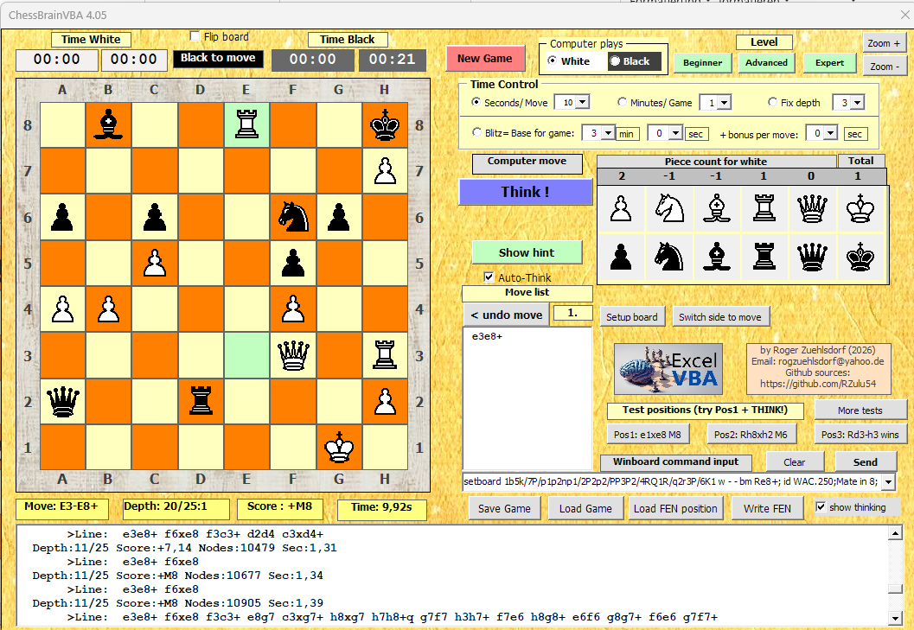

# ChessBrainVBA

**ChessBrainVBA** is a chess AI engine with a built-in chess board GUI, designed for **Microsoft Excel VBA**. It has an estimated playing strength of approximately **2600 Elo**.  
This engine is based on *ChessbrainVB* (the version written in Visual Basic 6, which is about 15x faster).

### The Visual Basic Chessbrain Engine Family
See the full collection at: https://github.com/RZulu54

* **VB6** (Visual Basic 6): ChessbrainVB (~3125 Elo)
* **VBA** (Excel Visual Basic for Applications): ExcelChessbrainX (~2600 Elo)
* **VB.NET** (Visual Basic .NET): ChessbrainVbNet (~3300 Elo)
* **QB64** (QBASIC 64): ChessbrainQB64 (~2700 Elo)
* **FreeBasic** : ChessbrainFB (~3150 Elo)

---

# Usage
1. Open the file `ExcelChessBrainX_4.06.xlsm`. 
2. A full installation of **Microsoft Excel** (32-bit or 64-bit) is required to run the VBA code. No additional files are needed at runtime.
3. Ensure that **Macros are enabled**. 
4. If the file is blocked, make sure it is marked as **safe** in the file properties: `Right-click file > Properties > General > Security > Unblock`.

---

# Features
* Code is **100% Visual Basic for Applications (VBA)**.
* Includes a GUI with a chess board, time controls, chess clocks, and board setup.
* Integrated opening book (approx. 48,000 lines included within the Excel file).
* Evaluates approximately **5,000–15,000 positions per second**.
* Fully implements all standard chess rules:
    * Castling
    * En passant
    * Threefold repetition
    * 50-move rule

# Limitations
* No support for endgame tablebases.
* No pondering.
* No support for multiple CPU cores (single-threaded).

# Changes
**Changes from V4.03a to V4.06:** (Older versions are included in the ChessbrainVB project, also for MS Word and MS Powerpoint) 
* Added chess clocks.
* Minor bug fixes and code cleanup.

# Security Note
Some antivirus programs may report false positives due to the included macros. To verify the safety of the file, you can scan it using:  
https://www.virustotal.com

# Contact
For questions or feedback, please contact:  
**Email:** rogzuehlsdorf@yahoo.de

---

### Credits
This chess engine is based on the source code of **LarsenVB** by Luca Dormio (http://xoomer.virgilio.it/ludormio/download.htm).  
LarsenVB was inspired by **Faile 0.6** by Adrien M. Regimbald.  
I would like to thank Luca Dormio for his permission to use his LarsenVB source code.

**ChessBrainVB** is also based on many great ideas from the following people:  
* **Marco Costalba / Tord Romstad / Joona Kiiski (Stockfish sources):** Search logic, king safety, and piece evaluation.
* The search logic and evaluation are based on **Stockfish 7**, with adaptations to non-bitboard data structures and search changes that perform better for slower move generation and evaluation.
* **Raimund Heid (Protector sources):** Material draw logic.

----------------------------------------------------------------------
Keywords: "VBA chess engine", "Excel chess engine", "VBA chess game", "Excel chess program", "VISUAL BASIC for APPLICATIONS chess"